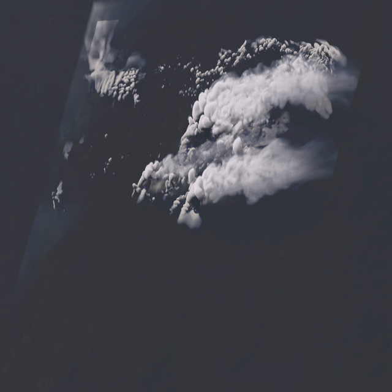
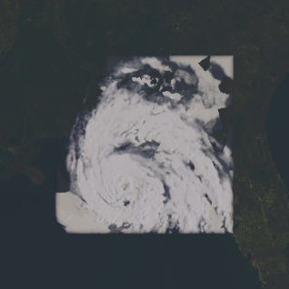
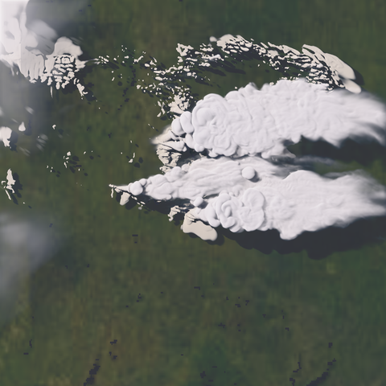
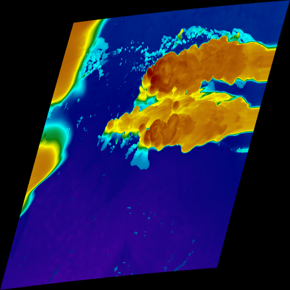
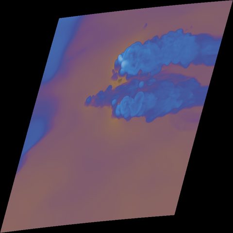
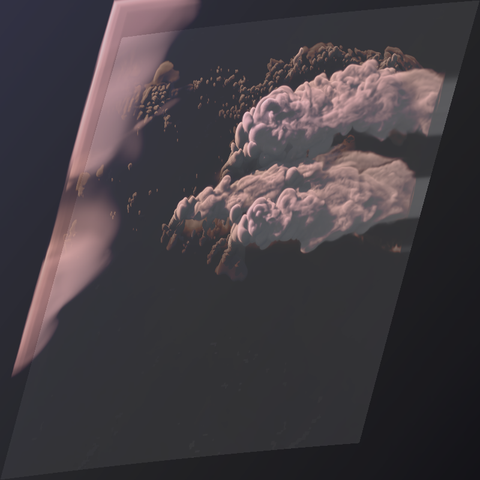
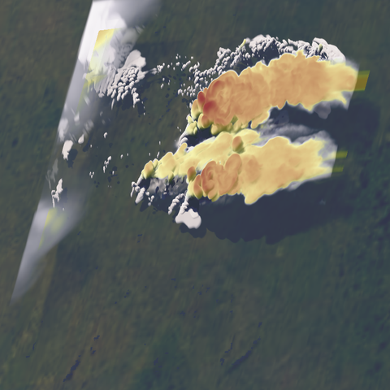
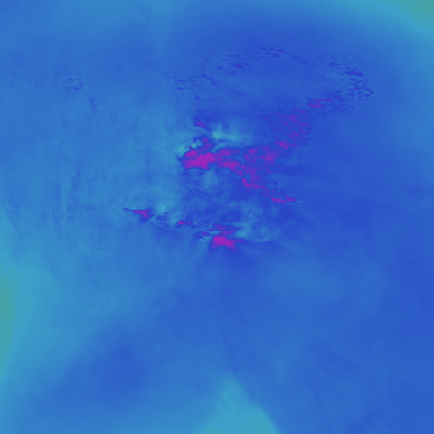

# SimSat Studio

Physically-based simulated satellite imagery from WRF model output.

SimSat renders what a geostationary weather satellite would see looking at your
WRF run: NASA Blue Marble ground with terrain shadows and seasonal blending, a
finite-disk sun with real twilight, volumetric clouds with multiple scattering,
Cox-Munk water sun-glint — and synthetic thermal infrared through the same
true-Kelvin enhancement pipeline the real GOES/Himawari products use. It ships
as a desktop app (`simsat_studio`, Rust/egui/wgpu), a headless CLI, and a
numpy-returning Python binding (`import simsat`).

## Gallery

All frames below are real SimSat renders of real WRF output (a North Dakota
supercell case and Hurricane Michael), thumbnailed for the README.

| | |
|---|---|
|  **True-color visible** — from-space geostationary view, volumetric clouds with cloud shadows |  **Hurricane Michael** — with the zoom-out margin: the WRF domain framed by the real surrounding earth |
|  **Top-down map view** — north-up, registered to the WRF domain's own map projection |  **Infrared band 13 (10.3 um)** — true-Kelvin brightness temperature, Rainbow enhancement; works day and night |
|  **Water vapor 6.2 um (band 8)** — upper-level moisture, classic WV palette |  **GeoColor Style / SimSat Day-Night Color** — broad-RGB day, IR night, blended across the real terminator (shown here at sunset) |
|  **Sandwich** — visible texture with color-enhanced cold cloud tops (severe-convection view) |  **Derived fields** — precipitable water, cloud-top temperature, cloud optical depth as raw map-registered arrays |

## Products

- **Visible true-color** — the full physical pipeline: Hillaire clear-sky
  atmosphere (transmittance / multiple-scattering / sky-view LUTs), volumetric
  cloud raymarch with Wrenninge multi-scatter octaves, SH-2 directional sky
  ambient, penumbral cloud and terrain shadows, seasonal Blue Marble ground,
  Cox-Munk glint, snow blend, ABI-style display transform.
- **Infrared band 13 (10.3 um)** — a real radiative-transfer march (gray-body
  Planck emission per voxel + surface term) inverted to true-Kelvin brightness
  temperature. The default/recommended display is CIMSS Style (`cimss`), with
  false-color isotherm bands that make cloud-top structure easy to read. NOAA's
  continuous heritage bi-linear grayscale (`natural`), legacy linear grayscale,
  and the BD, Rainbow, AVN, and Funktop palettes remain available unchanged.
- **Water vapor 6.2 / 6.9 / 7.3 um (bands 8/9/10)** — the same thermal march
  with water vapor as the dominant emitter; upper/mid/lower-level moisture.
- **GeoColor Style / SimSat Day-Night Color** — broad-RGB visible by day, IR by night,
  crossfaded per pixel across the terminator. This is not yet sensor-derived ABI GeoColor;
  the established `geocolor` CLI/Python token remains supported.
- **Sandwich** — color-enhanced IR overlaid on the visible base over cold cloud
  tops (a daytime severe-convection product).
- **Derived fields** — precipitable water (mm), cloud-top temperature (K), and
  cloud optical depth as raw `f32` map-registered arrays.

Three camera modes: the **from-space geostationary view** (GOES-East /
GOES-West / Himawari presets, CGMS fixed-grid scan geometry), a **top-down map
view** registered to the WRF domain's own projection (drops straight onto
matplotlib/cartopy axes), and a **free perspective camera** (arbitrary
eye/look/FOV through the same physics — angled 3-D storm shots and flyovers;
interactive orbit controls in the studio, `eye=/look=/fov=` in the CLI,
`render_perspective` in Python). A **web map layer** product renders the cloud
field as a transparent EPSG:3857 overlay (straight-alpha clouds + a multiply
shadow layer) for Mapbox-class basemaps.

New in v0.2.1: **CIMSS Style is the reviewed Band-13 display default**. Fresh
Studio settings, the Recommended IR quick preset, thermal product transitions,
and the headless IR CLI now select `cimss`. An explicitly saved `natural` choice
is preserved, Sensor QA retains its neutral Natural grayscale, and Python still
returns raw Kelvin unless a display enhancement is explicitly requested. Palette
selection never changes the raw floating-point Kelvin field.

New in v0.2.0: **natural infrared, faster reviewed cloud closure, and cleaner
top-down lighting**. Band 13 now defaults to NOAA's continuous heritage
`natural` grayscale, which preserves the raw floating-point Kelvin field without
turning smooth cold-cloud gradients into false-color red rings; CIMSS, BD, AVN,
Funktop, Rainbow, and legacy grayscale remain explicit analysis choices. The
Recommended display path now uses a deterministic two-subcolumn maximum-overlap
closure, with the higher-member references and effective-OD closure still
available. Low-sun land recovery is more useful, top-down cloud-front atmosphere
is restored, and top-down ground cloud shadows receive a display-only antialiasing
pass. The post-light surface toe remains an opt-in, default-off experiment. All
relevant controls are available in Studio, the CLI, and Python.

New in v0.1.7 development: **explicit render intent and provenance**. `Display`
is the unchanged default and preserves the reviewed SimSat look. `Sensor Fast
Gray` (`simsat-fast-gray-v1`) uses unscaled cloud extinction and neutralizes
display-only exposure, land, haze-correction, edge-feather, granulation,
stratiform-reconstruction, highlight, and synthetic-green shaping on a cloned
request. Every automatic adjustment is reported, and model fractional clouds
remain enabled. This is intentionally named *Fast Gray*: it is not yet an
instrument-SRF-integrated ABI/AHI channel, science-brick profile, or PSF/MTF
simulation. See [the render-intent note](docs/v017-render-intent.md).
The same development line also adds official GOES-R ABI ellipsoid/fixed-grid
navigation, an official GOES-19 Band-13 spectral-response option, exact-grid
visible and raw-Kelvin GOES validators, deterministic fractional-subcolumn and
directional-transport references, and opt-in native-moment cloud optics where
the source microphysics supplies enough information. These science paths are
explicitly labeled and do not silently replace the reviewed Display defaults.

New in v0.1.8 development: Studio adds three transparent one-click setting
presets: **Recommended Display**, **High Quality Visible**, and **Sensor QA**.
Each shows its exact current before/after diff, saves immediately, and leaves all
individual controls available. Invalid product/camera/satellite combinations are
refused instead of silently converted. CLI and Python equivalents remain explicit
to avoid duplicating Studio-only policy; see
[the recommended-settings contract](docs/v018-recommended-presets.md).

New in v0.1.9: visible surface lighting now stays physically useful
through low sun instead of switching important land controls on only after the
scene is already well into daylight. Land normalization, dark-toe recovery,
ground lift, and water-albedo assistance share a 0--12 degree surface-help ramp;
direct water sunlight is no longer artificially day-gated. The reviewed display
path uses a `0.45` diffuse cloud-shadow floor, while standalone cloud layers stay
neutral at night so they cannot black out a host basemap. Finite-sun cloud-shadow
softening now uses the Sun's angular radius rather than its diameter. CPU and GPU
implementations are covered by parity/regression locks. The selected behavior
passed a seven-anchor lighting review plus an 11-image sweep over ten distinct
WRF/HRRR runs (Hurricane Michael was checked in both geostationary and top-down
views). This is a targeted lighting correction: it does not add another global
gamma transform or change the reviewed visible defaults of exposure `1.5`,
aerosol optical depth `0.05`, and cloud-OD scale `0.15`.

New in v0.1.6: **faster GPU preview and improved top-down rendering**. Studio has
a one-click GPU Render action, while Rust, the CLI, and Python expose the same
`gpu-preview` backend with every temporary compatibility adjustment reported.
Top-down renders now honor Model native, ABI 1 km, and ABI 2 km resolution, and
preserve the physical aspect ratio when capped. An opt-in, default-off
stratiform reconstruction control can reduce source-grid cloud rings in affected
HRRR fields without changing geostationary or raw-band output. Optional bounded
delta-flux cloud-transport experiments (including the opt-in successive-order
angular-memory candidate) are also available across the interfaces.

New in v0.1.5: **brighter terrain and natural finite-domain cloud edges**.
The visible preset raises exposure while retaining highlight control, adds
sun-angle-aware land normalization, and feathers clouds only where the finite
model boundary is exposed. All presentation controls remain independently
switchable in Studio, the CLI, Python, and Rust.

New in v0.1.4: **model-aware fractional-cloud coverage and visible calibration**.
WRF `CLDFRA` is preserved where supplied; condensate cells with missing or
contradictory zero coverage are repaired with WRF's Xu-Randall diagnostic. HRRR
`wrfnat` now ingests its native 50-level cloud-fraction field. Both sources use
maximum-overlap vertical remapping, so anvil margins and cloud tails can fade
instead of filling every model cell as an opaque slab. Fractional coverage is on
by default and has an explicit legacy off switch in Rust, the CLI, Python, and
Studio. Sources without a complete trusted field retain the conservative
full-cell fallback.

The current visible preset uses cloud-OD scale `0.15`, exposure `1.5`, a restrained sun-gated
ground lift of `1.10` (`1.0` remains the neutral override),
highlight knee `0.65`, highlight ceiling `1.25`, and the owner-selected tight twilight
terrain recovery (`0.30 / 0.50 / 4.0`) from -6 through +12 degrees solar elevation. The
older broad post-light surface toe remains off. The OD value is the owner's
cross-file visual selection, superseding the earlier tied `0.20`/`0.30` midpoint
candidate. It is not a claimed physical optimum; every value remains overridable. Raw RGB
reflectance, thermal products, and derived cloud optical depth do not consume these display
controls. The High Quality Visible preset retains this baseline except for its selected
deterministic-4 cloud geometry and `0.45` cloud-highlight knee. The SSB format is v6, so older source-backed caches rebuild once. That rebuild
preserves the available HRRR/RRFS `SNMR` snow identity instead of discarding it after the
total-precipitation merge; a cached-only run still needs its original source file to upgrade.

New in v0.1.3: **atmosphere and cloud fidelity controls** — terrain-height
atmospheric columns, consistent daytime aerial-veil correction across the
surface and cloud-front airlight, optically-thin multi-scatter gating, and a
bounded visible cloud optical-depth sensitivity scale. AOD, RH swelling,
atmosphere correction, terrain atmosphere, clouds, multiscatter, Beer-powder,
granulation, and cloud-OD controls are available in Studio, the CLI, and Python.

New in v0.1.2: **operational-model ingest** — NOAA **HRRR** native-level GRIB2
(`wrfnat`) opens directly in the studio/CLI/Python exactly like a wrfout;
**RRFS** (rotated lat-lon, `natlev`) ingests via the CLI with a regional crop.
Plus an experimental opt-in GPU cloud renderer (preview-only; stored frames
always use the tested CPU path).

## Quickstart (desktop app)

1. Launch SimSat Studio and open a `wrfout` file (or a whole sequence folder).
2. Confirm the ingest — the file is streamed into a compact quantized volume
   brick (an 800x800x80 ~2 GB wrfout ingests in ~15 s and caches for reuse).
3. Pick a satellite, view, and product; press **Render**.
4. For animations: open a sequence, press **Render sequence**, then scrub/play
   the in-studio timeline.

Frames and loops can also be written to a sat-store directory (a simple
grid + per-time frame layout) for downstream viewers.

## Headless CLI

Two named binaries render without a GPU or GUI (`cargo build --release --bins`):

```
simsat-render-frame input=wrfout_d03_2025-06-21_02:15:00 out=frame.png \
    intent=display sat=goes-east view=geo aod=0.05 rh-swelling=off \
    atmosphere-correction=on terrain-atmosphere=on fractional-clouds=on cloud-od-scale=0.15 \
    multiscatter=on beer-powder=off granulation=off feather-exposed-domain-edges=on clouds=on
simsat-render-ir input=wrfout_d03_2025-06-21_02:15:00 out=ir.png \
    bt-out=ir-band13-kelvin.bin enhancement=cimss sensor=goes-r-abi-band13-fm4
```

`simsat-render-frame` renders visible, GeoColor Style/SimSat Day-Night Color, and Sandwich;
`simsat-render-ir` renders IR, water vapor (`wv=6.2|6.9|7.3`), and the derived
fields (`derived=pw|ctt|cod`). Both take `key=value` arguments (run with
`--help` for the full list) and print a machine-readable `SUMMARY` line.
Use `intent=display|sensor-fast-gray`; `mode=` remains an alias for `view=`.
Sensor Fast Gray currently requires the CPU backend because the bounded GPU
preview would disable model fractional-cloud handling and restore display
highlights, violating the strict operator.

Band 13 defaults to the existing `sensor=fast-gray` center-wavelength response.
The opt-in `sensor=goes-r-abi-band13-fm4` response integrates Planck emission
through NOAA's official FM4/GOES-19 ABI channel-13 SRF and uses the same response
for BT inversion. Cloud/gas absorption remains gray and is explicitly warned in
CLI/API/Python/Studio metadata.
The CLI-only `bt-out=<file.bin>` audit option writes the raw, unletterboxed
north-first scalar brightness-temperature plane as little-endian float32 Kelvin;
NaN denotes no data. It is intentionally not a Studio display option.
Visible renders expose the same atmosphere/cloud QA controls as Studio and Python:
numeric aerosol AOD (`0` disables aerosol), RH swelling, reduced-versus-full
aerial airlight, terrain-height atmosphere, model fractional clouds, multiscatter,
beer-powder, granulation, exposed-domain edge feathering, clouds, and a shipped `0.15`
cloud optical-depth scale
(`1.0` is unscaled model extinction; `0` disables visible cloud extinction; valid
range `0.0..=4.0`). The `0.15` default is an owner-selected cross-file visual
calibration, not a claimed physical optimum. Finished RGB products also expose
`exposure=`, `ground-gain=`, `cloud-softclip=`, and `cloud-highlight-max=`;
omitting them keeps the shipped `1.5` exposure, `1.10` ground gain (`1.0` is neutral), `0.65`
highlight knee, and `1.25` highlight ceiling.
`fractional-clouds=off` restores legacy horizontally-full cloudy cells; `on` remains
the compatibility alias for `effective-od`. Finished display renders now default to
the reviewed `fractional-clouds=deterministic-2` closure. The explicit
`deterministic-2`, `deterministic-4`, `deterministic-8`, and `deterministic-16` CPU
modes march the selected number of fixed-stratified shared-u maximum-overlap
subcolumns and average linear radiance before one tonemap. These are deterministic
convergence references, not full max-random/Sobol McICA; cost grows with member count.
The scale
is an explicit sensitivity control and does not alter the raw derived cloud-optical-
depth product; beer-powder and granulation remain opt-in/off by default. Owner-selected
v0.1.5 edge feathering defaults on. `feather-exposed-domain-edges=on` reuses the fixed 4% cloud-edge
band when a finished visible or cloud-layer camera raster exposes the WRF boundary;
with it off, the pre-v0.1.5 positive-margin behavior is unchanged, and raw visible bands,
IR/WV, and derived products ignore the control.

Single-frame visible previews can explicitly select the shared Studio wgpu cloud pass
with `backend=gpu-preview` (`cpu` remains the default). The preview preserves `view=geo`
or `view=topdown`, reports every temporary compatibility substitution on stderr, and
never writes a sat-store frame. A missing adapter or unsupported rotated-lat/lon source
is an error rather than a silent CPU fallback.

Animated GIF loops are exported from a completed store run:

```
cargo run --release -p simsat --example export_animation -- \
    run=/path/to/store/simsat/mystorm_rgb_goese_20250621 out=loop.gif fps=8
```

GIF is palette-quantized (256 colors/frame) and its frame delays are quantized
to centiseconds — documented, honest format limits; no ffmpeg is bundled.

## Python binding

`import simsat` returns numpy arrays plus georeferencing (extent + PROJ string +
lat/lon mesh) for every product, ready for matplotlib/cartopy:

```python
import simsat
rgb, geo = simsat.render_visible_rgb(
    "wrfout_d03_...",
    backend="cpu",  # or "gpu-preview" for the synchronous Studio wgpu path
    view="topdown",
    aerosol_optical_depth=0.05,
    rh_aerosol_swelling=False,
    atmosphere_correction=True,
    terrain_atmosphere=True,
    land_sza_normalization=True,   # owner-selected display default
    land_sza_max_gain=4.0,         # bounded low-sun terrain recovery; 1.0 is identity
    land_dark_toe=True,            # independently switchable; both false = legacy identity
    surface_postlight_toe=False,   # opt-in CPU/GPU terrain recovery after lighting/view attenuation
    surface_postlight_toe_knee=0.18,
    surface_postlight_toe_gamma=0.80,
    surface_postlight_toe_max_gain=1.35,
    twilight_surface_recovery=True,   # shipped tight low-sun terrain recovery; independently switchable
    twilight_surface_recovery_knee=0.30,
    twilight_surface_recovery_gamma=0.50,
    twilight_surface_recovery_max_gain=4.0,
    fractional_clouds=True,
    fractional_cloud_mode="deterministic-2",  # Recommended; effective-od remains explicit
    cloud_optical_depth_scale=0.15,
    beer_powder=False,
    granulation=False,
    feather_exposed_domain_edges=True,  # owner-selected v0.1.5 finite-domain default
    topdown_stratiform_regularization=False,  # opt-in top-down low-deck reconstruction
)
ax.imshow(rgb, extent=geo.extent, origin="upper")
```

See [crates/simsat_py/README.md](crates/simsat_py/README.md) for the full API
(`render_visible_rgb`, `render_rgb_reflectance`, `render_ir`,
`render_water_vapor`, `render_geocolor`, `render_sandwich`,
`render_precipitable_water`, `render_cloud_top_temp`,
`render_cloud_optical_depth`) and wheel-building instructions. The deprecated
`render_visible_bands` alias remains available and returns exactly the same array.

The experimental `topdown_stratiform_regularization` switch is off by default. It is
a bounded, optical-depth-conserving observation-operator approximation for coarse-grid
low stratiform decks, not a literal satellite footprint or new microphysics, and it
cannot recover unresolved cloud/clear structure. Geostationary and raw-band products
ignore it; Studio falls back to CPU if a GPU preview cannot consume the reconstructed
field exactly.

## Exact-grid GOES validation

`scripts/fetch-goes-abi-reference.py --align` is the single fetch/navigation path for
official ABI references. After rendering the same north-first target grid, the focused
validator compares either a finished PNG or `render_frame rgb-reflectance-out=...` f32le RGB
dump (`bands-out=` remains a deprecated compatibility alias):

```powershell
python scripts/simsat-validate-goes.py `
  --synthetic simsat-rho.bin `
  --reference abi-reference-aligned.npz `
  --output-dir goes-validation
```

Band 13 uses the same exact grid and the raw `render_ir bt-out=...` plane:

```powershell
python scripts/simsat-validate-goes.py `
  --product abi-band13 `
  --synthetic ir-band13-kelvin.bin `
  --reference abi-reference-aligned.npz `
  --output-dir goes-band13-validation
```

The output includes observed/synthetic/difference images, a joint histogram, explicit
ABI clear/land/cloud-temperature masks, JSON bias/MAE/RMSE/quantiles/correlation,
multi-scale brightness FSS, spatial-spectrum summaries, and input/source hashes. These
are collocation diagnostics, not forecast pixel-match or observation-operator skill.
For Band 13, the fixed 180--320 K cold-white enhancement, signed ±40 K difference,
cold-event area/contingency/FSS at 260/235/220/205 K, and NumPy-only connected-object
centroid summaries are documented in the JSON. The command requires NumPy and Pillow;
`--self-check` exercises visible PNG/RGB and Band 13 scalar layouts without network access.

## Honest limitations

Clouds and weather exist only inside your WRF domain — the zoom-out margin shows
the real surrounding earth under a clear sky, not extrapolated weather. The
earth is spherical (R = 6370 km, WRF's own geometry): the standard is physical
plausibility, not pixel-level registration against real ABI imagery. SimSat Day/Night
Color is GeoColor-style rather than sensor-derived ABI GeoColor, and its night side is
the IR composite only — no city-lights layer yet. The IR and
water-vapor bands use gray band-averaged absorption coefficients (documented in
the code) rather than line-by-line radiative transfer. The shipping render path
is CPU (rayon-parallel; a native-resolution 800x800 composite renders in about a
second on a desktop CPU). An explicit, display-only GPU cloud preview is available for
geostationary and top-down Visible frames; CPU remains the stored/batch quality path.

## Building from source

Requires a recent stable Rust toolchain (edition 2024, Rust 1.85+).

```
cargo build --release -p simsat_studio   # the desktop app
cargo build --release -p simsat --bins   # the headless CLI binaries
cargo test --workspace                   # the test suite (CPU-only, no GPU needed)
```

On Linux, the GUI/dialog dependencies need basic desktop development headers
(Debian/Ubuntu): `libxkbcommon-dev libwayland-dev libxcb-render0-dev
libxcb-shape0-dev libxcb-xfixes0-dev`.

The Python wheel builds from the standalone `crates/simsat_py` workspace:
`pip install maturin && cd crates/simsat_py && maturin build --release`.

## Ground imagery

The ground texture is NASA's Blue Marble Next Generation (2 km monthly
composites, blended to the day of year). Months download lazily at runtime and
are verified by SHA-256; a bundled 8 km composite is the offline fallback.
Imagery courtesy NASA Earth Observatory.

## License

Licensed under either of the [MIT license](LICENSE-MIT) or the
[Apache License, Version 2.0](LICENSE-APACHE), at your option. Third-party
license notices for the full dependency closure are in
[THIRD-PARTY-NOTICES.txt](THIRD-PARTY-NOTICES.txt).
